<!-- markdownlint-disable MD029 MD041 MD036 MD056 -->


# Simple PrayerTime Reminder

A desktop Muslim companion app for prayer times, reminders, Qibla, and more.

[](https://github.com/Dadangdut33/simple-prayertime-reminder/issues)
[](https://github.com/Dadangdut33/simple-prayertime-reminder/pulls)
[](https://github.com/Dadangdut33/simple-prayertime-reminder/releases/latest)
[>)](https://github.com/Dadangdut33/simple-prayertime-reminder/releases/latest)
[>)](https://sourceforge.net/projects/simple-prayertime-reminder/files/latest/download)
[](https://github.com/Dadangdut33/simple-prayertime-reminder/stargazers)
[](https://github.com/Dadangdut33/simple-prayertime-reminder/network/members)

This project was previously Electron-based which comes with chromium meaning higher bundle size. It now uses Webkit, possible by using Go with Wails V3 while still using modern beautiful frontend powered by React and MUI library.

## Table of Contents

- [Simple PrayerTime Reminder](#simple-prayertime-reminder)
  - [Table of Contents](#table-of-contents)
  - [Features](#features)
  - [Preview](#preview)
  - [Download](#download)
  - [Installation](#installation)
    - [Windows](#windows)
    - [macOS](#macos)
    - [Linux](#linux)
    - [Linux AppImage Notes For Non-Debian/Ubuntu](#linux-appimage-notes-for-non-debianubuntu)
    - [Install via Script](#install-via-script)
  - [Updating the App](#updating-the-app)
  - [Uninstallation](#uninstallation)
  - [Development Setup](#development-setup)
    - [Requirements](#requirements)
    - [First-time setup](#first-time-setup)
    - [Run in development mode](#run-in-development-mode)
    - [Contributing Translations](#contributing-translations)
      - [Using Fake Time](#using-fake-time)
      - [Stopping Rogue Process](#stopping-rogue-process)
    - [Build the app](#build-the-app)
    - [GitHub Actions (Build Triggers)](#github-actions-build-triggers)
  - [Useful Commands](#useful-commands)
  - [Project Layout](#project-layout)
  - [Configuration](#configuration)
  - [Help](#help)
  - [Attribution](#attribution)
  - [License](#license)

## Features

- Daily prayer schedule and next-prayer countdown
- Configurable prayer calculation method, offsets, and reminder timing
- Adhan playback with adjustable volume
- Auto-detected or manual location setup
- Qibla direction
- Monthly prayer timetable export to CSV and Excel
- System tray integration and reminder window
- Embedded Quran page (quran.com) with simple note system

## Preview

| Light                                      | Dark                                      |
| ------------------------------------------ | ----------------------------------------- |
| 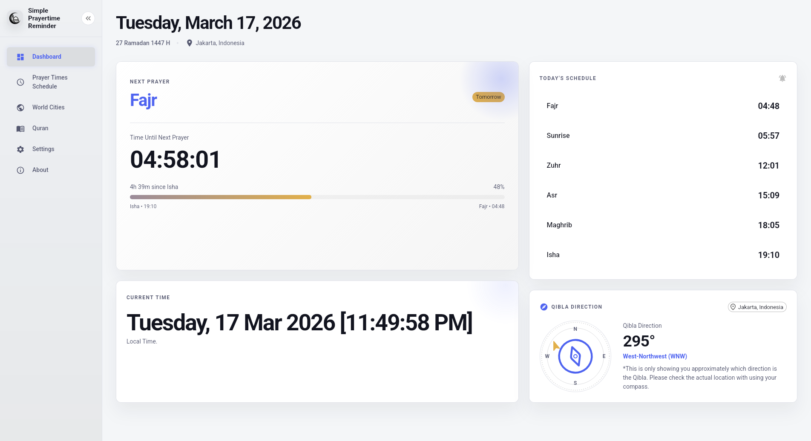         | 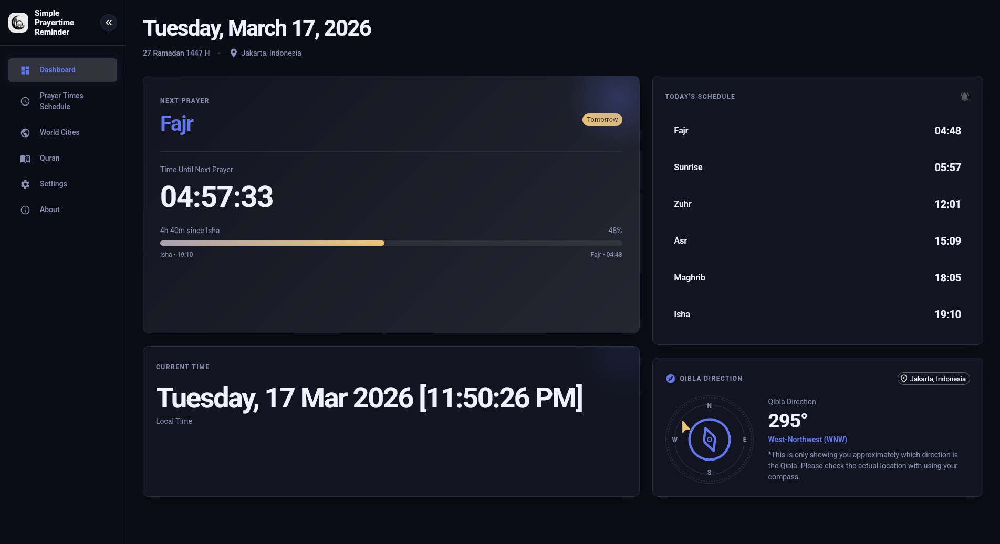         |
| 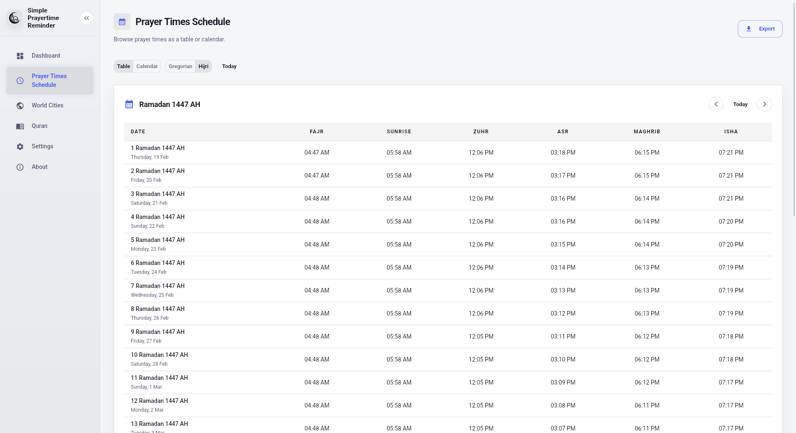     | 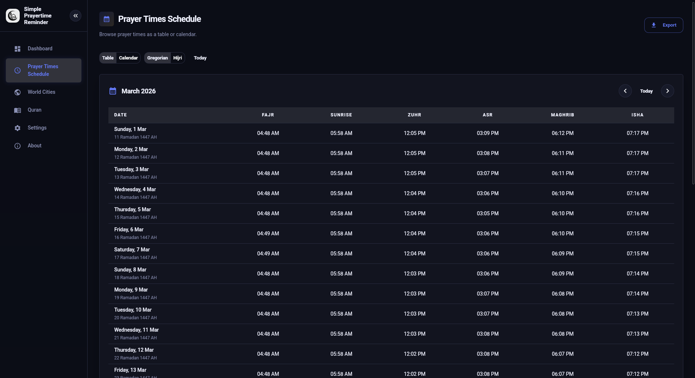     |
| 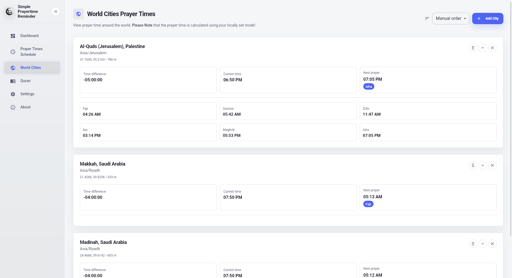 | 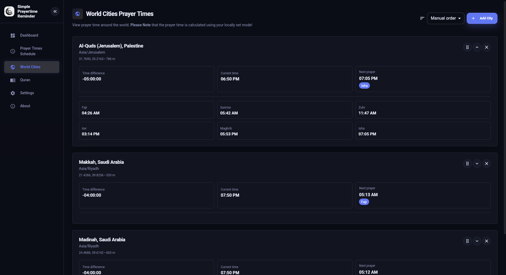 |
| 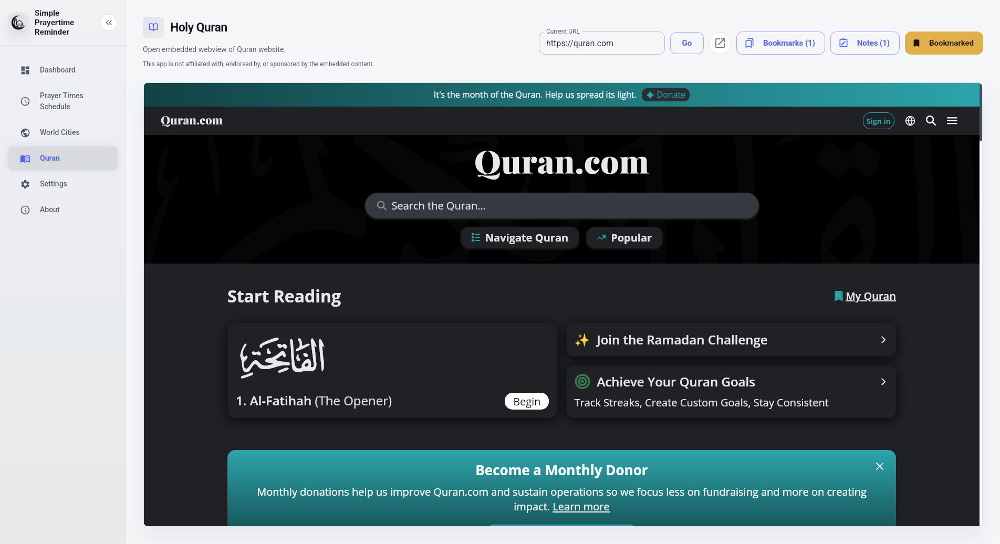  | 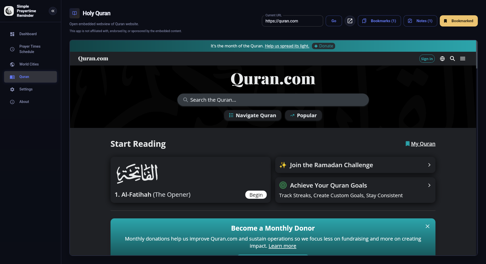  |
| 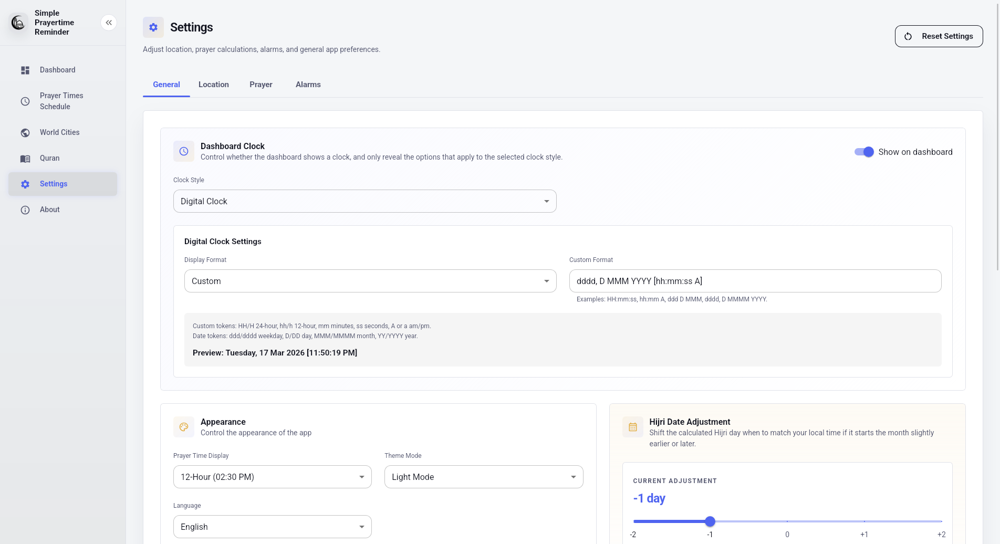     | 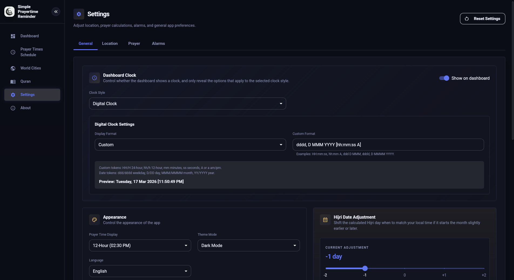     |
| 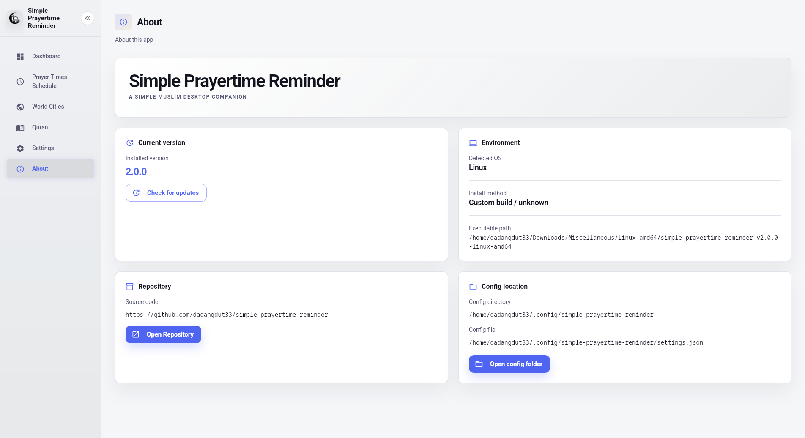        | 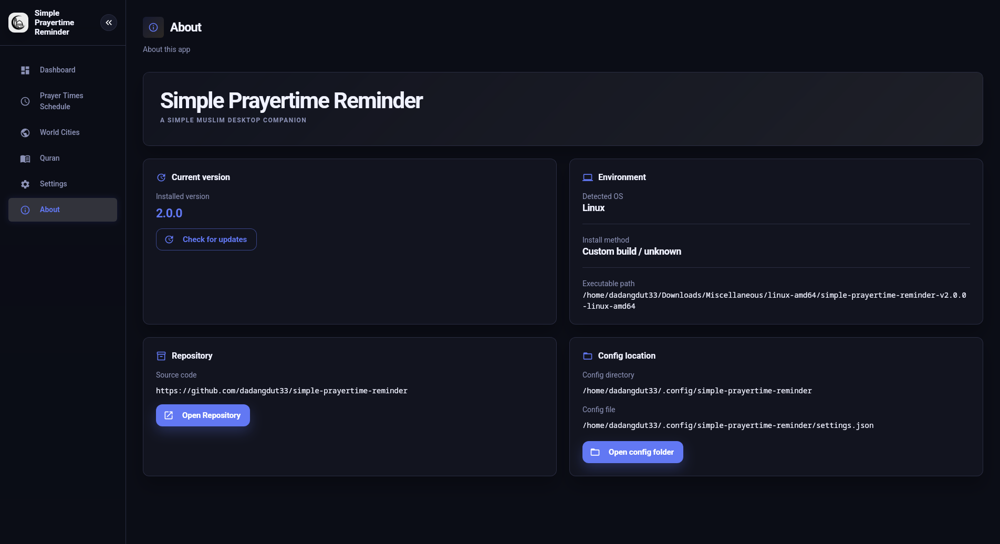        |
| 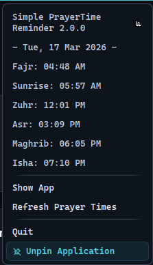                |

## Download

- [Latest release](https://github.com/Dadangdut33/simple-prayertime-reminder/releases/latest)
- [SourceForge mirror](https://sourceforge.net/projects/simple-prayertime-reminder/)

## Installation

### Windows

**Installer:**

1. Download the latest `*-installer.exe` from [GitHub Releases](https://github.com/Dadangdut33/simple-prayertime-reminder/releases/latest).
2. Run the installer and follow the prompts.
3. Launch the app from the Start menu.

**Portable (no installer):**

1. Download the latest Windows portable `.exe` (without `installer` in the name).
2. Place it anywhere (e.g., `C:\Apps\simple-prayertime-reminder\`).
3. Double‑click to run.

### macOS

**App bundle:**

1. Download the latest macOS `.app.zip` from [GitHub Releases](https://github.com/Dadangdut33/simple-prayertime-reminder/releases/latest).
2. Unzip it.
3. Move `Simple Prayertime Reminder.app` to `Applications` and open it.

**Raw binary:**

1. Download the macOS raw binary from [GitHub Releases](https://github.com/Dadangdut33/simple-prayertime-reminder/releases/latest).
2. Put it somewhere in your PATH, for example:

```bash
mkdir -p ~/.local/bin
mv simple-prayertime-reminder ~/.local/bin/
chmod +x ~/.local/bin/simple-prayertime-reminder
```

### Linux

**Recommended (DEB/RPM):**

1. Download the latest Linux package from [GitHub Releases](https://github.com/Dadangdut33/simple-prayertime-reminder/releases/latest).
2. Use the package appropriate for your distro (DEB/RPM).

**AppImage:**

> [!NOTE]
> The appimage build might only work properly on debian/ubuntu. This is because the github action runner is using ubuntu and since we are using webkit, the dependencies wont match. To fix this for other distroy, you can follow the [notes](#linux-appimage-notes-for-non-debianubuntu) section for making it work on other distro. The app will work but I found that the embed page feature does not work on my device (Arch linux).

1. Download the appimage version from [GitHub Releases](https://github.com/Dadangdut33/simple-prayertime-reminder/releases/latest).
2. Optionally, use app like gear lever to manage the appimage.
3. Launch the app.

**Raw binary:**

1. Download the Linux binary from [GitHub Releases](https://github.com/Dadangdut33/simple-prayertime-reminder/releases/latest).
2. Put it somewhere in your PATH, for example:

```bash
mkdir -p ~/.local/bin
mv simple-prayertime-reminder ~/.local/bin/
chmod +x ~/.local/bin/simple-prayertime-reminder
```

3. optionally, Create a desktop entry so it shows up in your launcher:

```bash
# change the username to your username
mkdir -p ~/.local/share/applications
cat > ~/.local/share/applications/simple-prayertime-reminder.desktop <<'EOF'
[Desktop Entry]
Name=Simple Prayertime Reminder
Exec=/home/{USERNAME}/.local/bin/simple-prayertime-reminder
Icon=prayer-time
Type=Application
Categories=Utility;
Terminal=false
EOF
```

4. Update the icon path if you want a custom icon (PNG recommended). For example:

```bash
mkdir -p ~/.local/share/icons
curl -L "https://raw.githubusercontent.com/Dadangdut33/simple-prayertime-reminder/main/assets/icon.png" -o ~/.local/share/icons/simple-prayertime-reminder.png
```

Then set in the desktop entry:

```bash
# change the username to your actual username
Icon=/home/{USERNAME}/.local/share/icons/simple-prayertime-reminder.png
```

### Linux AppImage Notes For Non-Debian/Ubuntu

The AppImage is built on Ubuntu and expects WebKitGTK helper binaries in Debian-style paths.
On other distros, install WebKitGTK and add a compatibility symlink so the helper can be found.

Arch Linux / Manjaro:

```bash
sudo pacman -S webkit2gtk gtk3
sudo mkdir -p /usr/lib/x86_64-linux-gnu
sudo ln -s /usr/lib/webkit2gtk-4.1 /usr/lib/x86_64-linux-gnu/webkit2gtk-4.1
```

Fedora / RHEL / Alma / Rocky:

```bash
sudo dnf install webkit2gtk4.1 gtk3
sudo mkdir -p /usr/lib/x86_64-linux-gnu
sudo ln -s /usr/lib64/webkit2gtk-4.1 /usr/lib/x86_64-linux-gnu/webkit2gtk-4.1
```

openSUSE:

```bash
sudo zypper install libwebkit2gtk-4_1-0 gtk3
sudo mkdir -p /usr/lib/x86_64-linux-gnu
sudo ln -s /usr/lib64/webkit2gtk-4.1 /usr/lib/x86_64-linux-gnu/webkit2gtk-4.1
```

### Install via Script

> **Requirements:** [Go 1.21+](https://go.dev/dl/), [pnpm](https://pnpm.io/installation), and [git](https://git-scm.com/)

**Linux / macOS**

```bash
bash <(curl -fsSL https://raw.githubusercontent.com/dadangdut33/simple-prayertime-reminder/main/scripts/install.sh)
```

**Windows (PowerShell)**

> You may need to allow script execution first. Run this in PowerShell as Administrator:
>
> ```powershell
> Set-ExecutionPolicy -ExecutionPolicy RemoteSigned -Scope CurrentUser
> ```
>
> This only needs to be done once. `RemoteSigned` allows local scripts and downloaded scripts that are signed; using `CurrentUser` scope means it won't affect other users and doesn't require admin.

```powershell
irm https://raw.githubusercontent.com/dadangdut33/simple-prayertime-reminder/main/scripts/install.ps1 | iex
```

The script will:

1. Build the frontend with pnpm
2. Install the binary to your Go bin directory (`$(go env GOPATH)/bin`)
3. Create a desktop entry for the app.

Make sure `$(go env GOPATH)/bin` (Linux/macOS) or `%GOPATH%\bin` (Windows) is in your `PATH`.

> **Why not `go install` directly?**  
> This app bundles a frontend (HTML/JS) that must be built before the Go binary is compiled. The install scripts handle that automatically.

## Updating the App

- Installer build : Download the latest installer and run it.
- Portable build : Replace the portable app with the newest release.
- Script installation (Linux / macOS) : Run again the one-liner in [Install via Script](#install-via-script)

## Uninstallation

- Installer build : run the uninstaller.
- Portable build : remove the portable app and its folder.
- Script installation (Linux / macOS) :

```bash
bash <(curl -fsSL https://raw.githubusercontent.com/dadangdut33/simple-prayertime-reminder/main/scripts/uninstall.sh)
```

- Script installation (Windows) :

```powershell
irm https://raw.githubusercontent.com/dadangdut33/simple-prayertime-reminder/main/scripts/uninstall.ps1 | iex
```

## Development Setup

### Requirements

- Go `1.25+`
- `pnpm`
- `wails3` CLI
- Platform dependencies required by Wails/WebView for your OS

This repo includes a `Taskfile.yml`, and the Wails CLI can run those tasks directly, so you do not need a separate `task` binary if you use `wails3 task ...`.

It is very recommended to install [taskfile](https://taskfile.dev/docs/installation) when developing.

### First-time setup

1. Install Go dependencies:

```bash
go mod download
```

2. Install frontend dependencies:

```bash
cd frontend
pnpm install
cd ..
```

3. Install the Wails v3 CLI if you do not already have it:

```bash
go install github.com/wailsapp/wails/v3/cmd/wails3@latest
```

### Run in development mode

```bash
wails3 task dev
```

This starts the Go backend, the Vite dev server for `frontend/`, and the desktop app together.

### Contributing Translations

We welcome translation contributions via pull request.

1. Copy [`frontend/src/i18n/locales/en.ts`](frontend/src/i18n/locales/en.ts) to a new locale file (e.g. `frontend/src/i18n/locales/id.ts`) and then edit it.
2. Also translate the hadith in the [`frontend/src/i18n/shared/reminder_quotes.json`](frontend/src/i18n/shared/reminder_quotes.json) file.
3. Add the new locale to `frontend/src/i18n/index.ts` resources.
4. Use a standard language code (ISO 639-1 or BCP 47, e.g. `id`, `en`).
5. The language selector automatically lists available locales.
6. Open a pull request with your changes.

#### Using Fake Time

When developing, you might want to mock your time and for this I provided a page to test the reminder option and I also make a simple wrapper for the time library in order for it to be compatible with libfaketime.

To use **libfaketime** you need to add faketime to the tags.

Use it like this:

```bash
faketime '2026-03-12 04:29:30' wails3 dev
# you need to pass faketime with its parameter or it will just use real time instead.
```

In order to do this, I created a simple wrapper for the [clock](./internal/clock/clock.go) which shouldn't cause any overhead when its not in use.

#### Stopping Rogue Process

You can use the script

```bash
task dev:kill:linux
task dev:kill:darwin
task dev:kill:windows

# or
go-task dev:kill:linux
go-task dev:kill:darwin
go-task dev:kill:windows
```

### Build the app

Build for the current platform:

```bash
wails3 task build
```

Create a packaged build for the current platform:

```bash
wails3 task package
```

Generated binaries are written to `bin/`.

### GitHub Actions (Build Triggers)

- **Tag push**: any `v*` tag triggers full CI and creates a draft release.
- **Manual run**: use the Actions page (workflow_dispatch).
- **Master push**: only runs when the commit message includes `[ci build]`.

## Useful Commands

Run the desktop app in development mode:

```bash
wails3 task dev
```

Build the frontend only:

```bash
cd frontend
pnpm run build
```

Type-check the frontend:

```bash
cd frontend
pnpm run typecheck
```

Build the server-mode binary:

```bash
wails3 task build:server
```

Build the Docker image for cross-compilation:

```bash
wails3 task setup:docker
```

## Project Layout

```text
.
├── main.go          # Wails app entrypoint and service bindings
├── internal/        # Go application logic
├── frontend/        # React + Vite frontend
├── build/           # Wails build assets and platform packaging config
├── assets/          # Icons and bundled audio assets
└── Taskfile.yml     # Build and packaging tasks
```

## Configuration

Application settings are stored in:

```text
~/.config/simple-prayertime-reminder/settings.json
```

The file is created automatically on first run.

## Help

- [Wiki](https://github.com/Dadangdut33/simple-prayertime-reminder/wiki)
- [Issues](https://github.com/Dadangdut33/simple-prayertime-reminder/issues)
- [Discussions](https://github.com/Dadangdut33/simple-prayertime-reminder/discussions)

## Attribution

- [Adhan uploaded by Ayat via YouTube](https://youtu.be/iaWZ_3D6vOQ)
- [Default link for Quran embed webview](https://quran.com)
- [Mosque icons created by Freepik - Flaticon](https://www.flaticon.com/free-icons/mosque)

## License

MIT © [Dadangdut33](https://github.com/Dadangdut33/simple-prayertime-reminder/blob/main/LICENSE)
